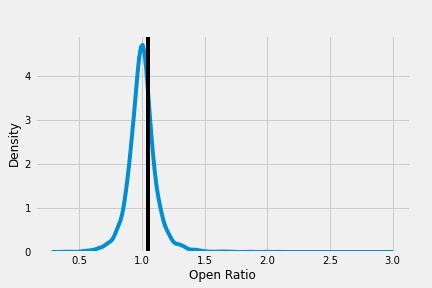

# Classification MVP
Peter Goff

### Goal: Predict the impact of quarterly earning reports on stock behavior
In quarterly earning reports, company leadership shares perspectives on the company, their fundamentals, challenges, mission, direction, investments, and general fiscal health of the organization. Quarterly earning calls are (typically) recorded conference calls where leadership summarizes the earnings report and often engages questions from those outside the organization. This project will explore the features of earnings calls that coincide with increased earnings.  
The content and sentiment of the call both shape public receptivity and direct subsequent action on the part of investors. Thus, the two key features for this study will be topic affiliation and sentiment. Additional market-based and call-based measures will be integrated as well.

### Defining the target
The target for this study are stocks that have or have not increased in value in the week following the quarterly earnings call. To temper against stochastic fluctuations, I will calculate each company's average stock price from the week prior to the call and compare this with the average stock price in the week following the call. This 7-day window may be tuned to be wider or narrower following EDA. An increase of five percent will be classified as a notable increase; anything less than this will be classified as not having a notable increase. This 5% threshold may also be tuned following EDA.  
The sample for this project is 4,264 observations from 350 technology stocks and 3,613 observations from 364 healthcare stocks across the past 7 years. Using the yfinance API I have collected stock price data for the week prior to and week following the quarterly earning report. The target is defined as stocks where the the ratio of the 7-day pre-call open price to the 7-day post-call open price shows an increase of 5% or more. The distribution of the ratio underlying the target is shown below with a vertical line showing the 5% threshold dividing positive outcomes (to the right) and zero outcomes (to the left).  

### Methodology
The initial pool of technology and healthcare stocks were selected based on [sector designation via Yahoo Finance](https://finance.yahoo.com/screener/new). Each of these stocks was then querried from Seeking Alpha's library of quarterly earnings call transcripts. Each search page for a given stock yeilds 10 links to related transcripts. Because some transcripts reference other companies, not all links provided transcripts for the company sought. I looked through the first 10 pages for the 10 most transcripts for each stock. As a result, the sample is not balanced in terms of observations per stock. Half of the stocks have between 10 and 12 observations; 90% of stocks have between 2 and 20 observations.  
The test data was selected using all 917 observations from 2021; this represents 17% of the total observations. A secondary test data set was constructed using 2,455 observations from 202 stocks in the energy sector.  
F1 and ROC AUC were selected for metrics for feature engineering and model selection. F1 was selected because of the dual importance of identifying all profitable investment opportunities (recall) and the need to minimize exposure to loss from conflating true positives with false positives (precision). ROC AUC was selected because probabilities would convey more information regarding the risk associated with any prediction than would a binary classification.  
A secondary test data set was constructed using 2,455 observations from 202 stocks in the energy sector. 

### Features
The features for this study are volume (7-day average leading up to the call), dividends, year (continuous), and day of the week (dummies), the slope of open prices for the 7-days prior to the call, the quarter, and sentiment analysis (polarity & subjectivity). Features were scaled and interacted with polynomial degree two.  

### Baseline Model
My baseline logistic regression model incorporates scaled second degree polynomials of the features listed above. Five-fold cross-validation of the baseline model shows poor predictive strength with a precision of 0.451, recall of 0.027, F1 of 0.051, and ROC AUC of 0.585. The precision value suggests the baseline model is more effective at avoiding poor investment recommendations (false positives) than it is at identifying the fruitful opportunities that exist in the data (recall). That said, the baseline model is weak across all metrics, so there's ample room for improvement as I expand across features and models. 

### Subsequent Models
Using 5-fold cross-validation and random/grid search for hyper-parameter tuning, I compared the following models with my baseline logistic regression model: knn(5), Random Forest, ExtraTrees, and XGBoost. The training results are shown below.

There was moderate class imbalance that was corrected for using oversampling. After oversampling, these five models were again compared using 5-fold cross-validation. The training results after imbalance correction are shown below.

XGBoost was selected as the optimal model. I also constructed random sentiment measures with the same mean and standard deviation as those observed in the training data. I re-ran the test validation with these random measures to observe the decline in predictive power. Test results are shown below.
